class: slide-front-page

.logo[

]
.details[
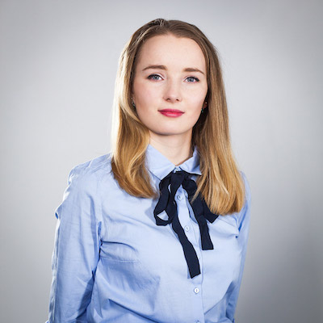
## Katarzyna Grabowska
## <em>"Podsumowanie 5-letniej działalności WarsawJS" [PL]</em>
## <small>2019-09-11</small>
## <a href="https://www.linkedin.com/in/katarzyna-grabowska-designer">linkedin.com/in/katarzyna-grabowska-designer</a>
]

---

# Ile wydarzeń zorganizowaliśmy

TODO

---

# Czego się nauczyliśmy?

.size45[

* ...

]

---

class: top, center

.size80[
Statystyki zeszłego roku!
]
.box.center[
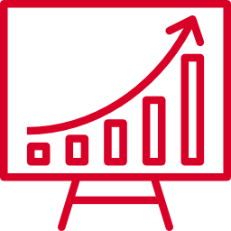
]

---

### <del>YouTube.com</del>/WarsawJS

.size45[

* _139 422_ wyświetlenia
    + wzrost o <var>+33 176</var> względem zeszłego roku
* <mark>1 777</mark> subskrypcje
    + wzrost o <var>+323</var> względem zeszłego roku

]

---

class: slide-grid, slide-grid-4-columns, thumbnails-grid

### Oglądaliście zaproszenia na meetupy?

.grid-board[

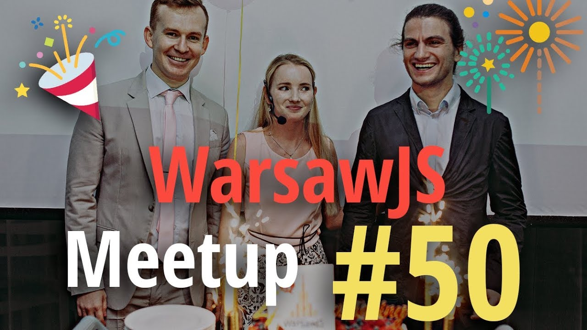

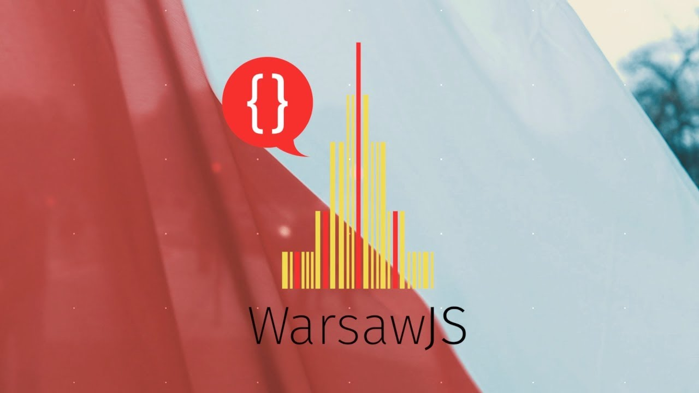

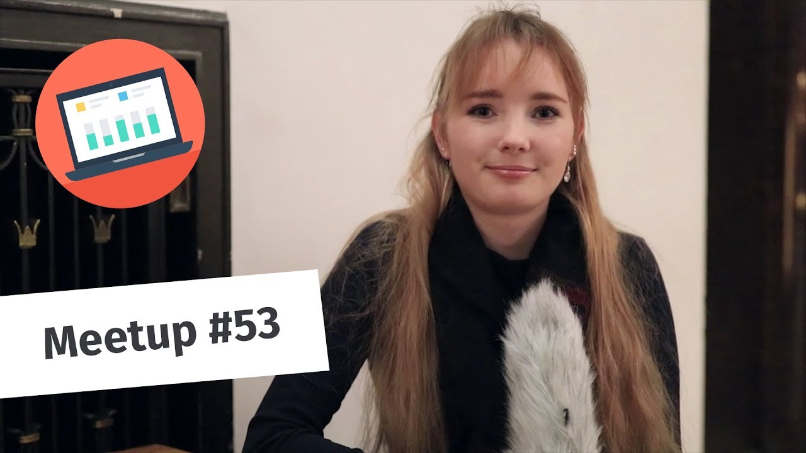

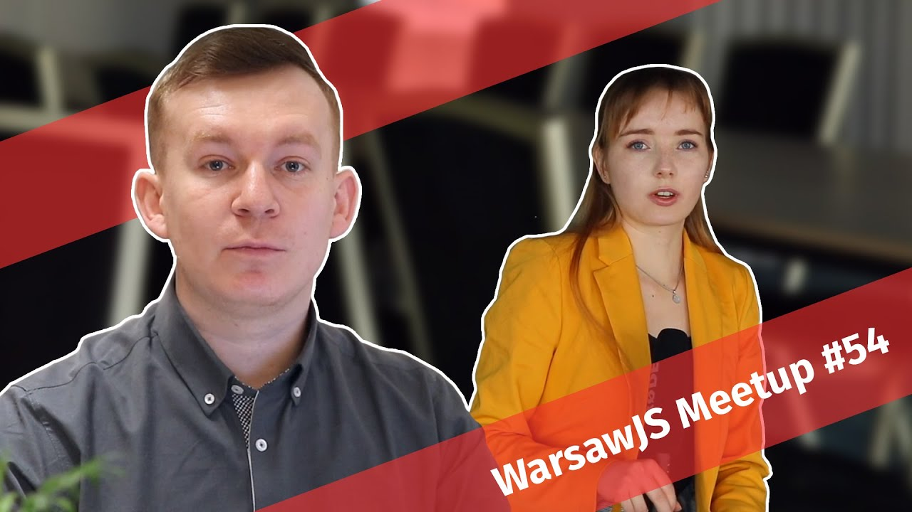

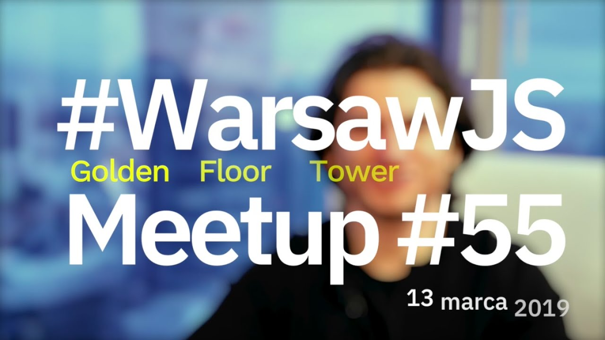

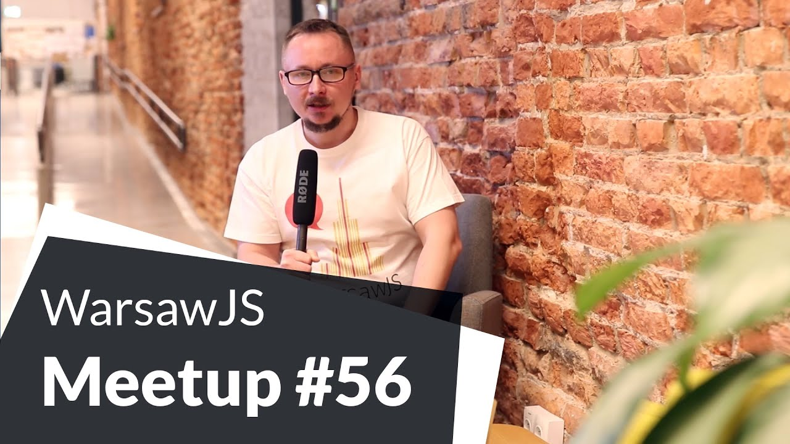

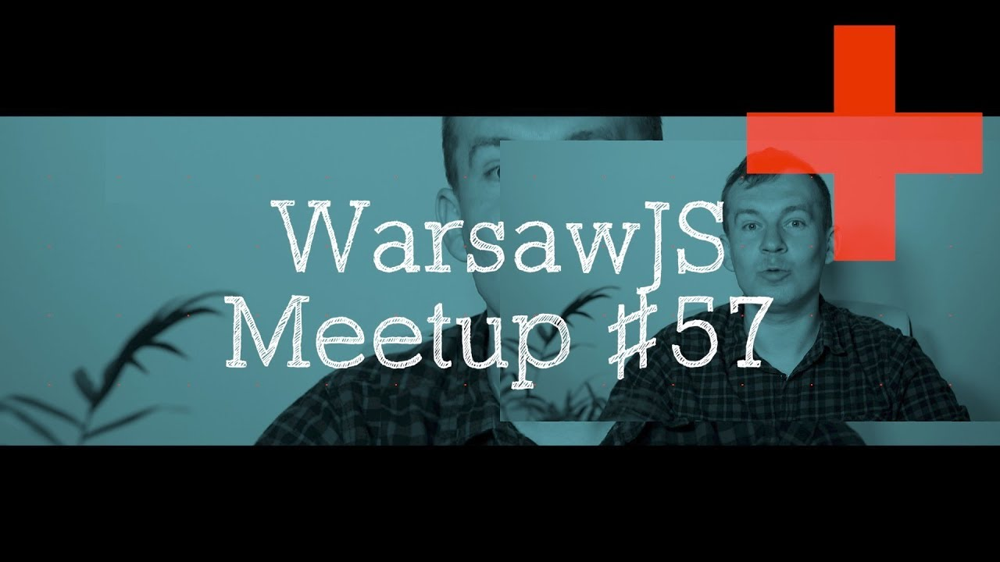

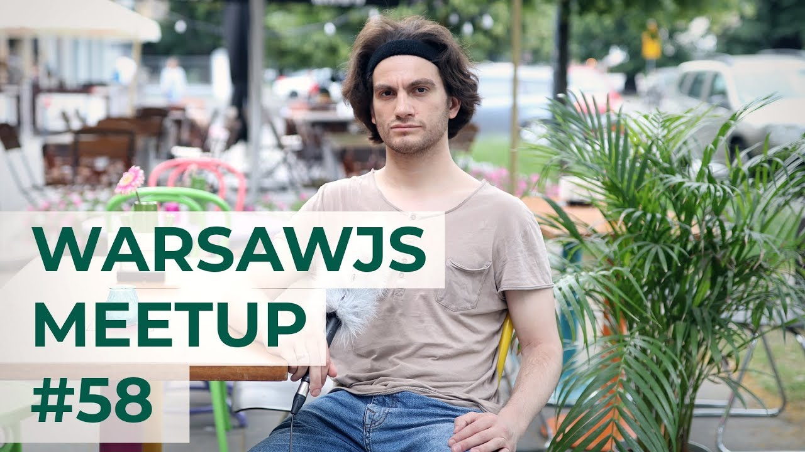

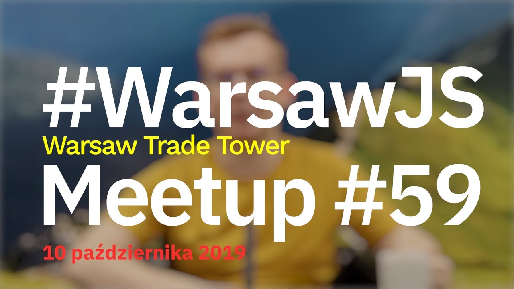

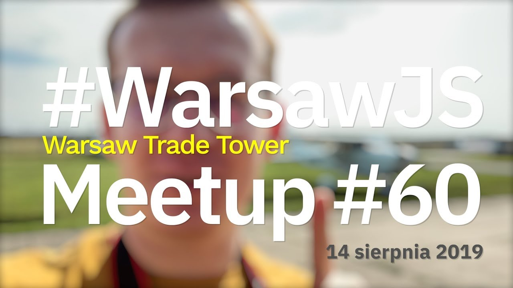

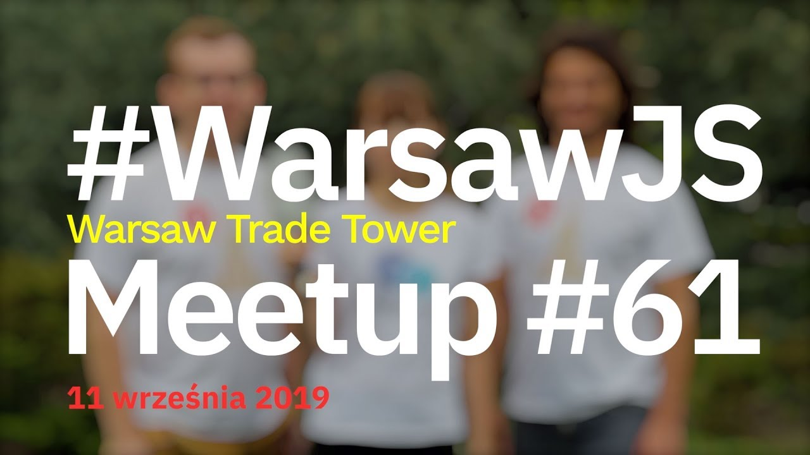

]

---

class: center

### Najpopularniejsza prezentacja <del>TODO wyświetleń<del>

*TODO* "TODO"

<iframe width="560" height="315" src="https://www.youtube.com/embed/XXX" frameborder="0" allow="autoplay; encrypted-media" allowfullscreen></iframe>

---

### <del>Meetup.com</del>/WarsawJS

.size45[

* _5 011_ osób w organizacji
    + wzrost o <var>+1 037</var> względem zeszłego roku

]

### <del>Twitter.com</del>/WarsawJS

.size45[

* <mark>1 300</mark> osób obserwujących
    + wzrost o <var>+651</var> względem zeszłego roku

]

---

### <del>Facebook.com</del>/WarsawJS

.size45[

* _2 682_ osób obserwujących
    + wzrost o <var>+394</var> względem zeszłego roku

]

### <del>Instagram.com</del>/WarsawJS

.size45[

* <mark>192</mark> osób obserwujących
    + wzrost o <var>+XXX</var> względem zeszłego roku

]

---

class: middle, center

# 🌟 Nowości w WarsawJS 🌟

---

class: middle, center, slide-invert-colors
background-image: url(images/Facebook_1920x1080px.jpg)
background-size: cover

---

class: slide-invert-colors

### ConFrontJS 2019

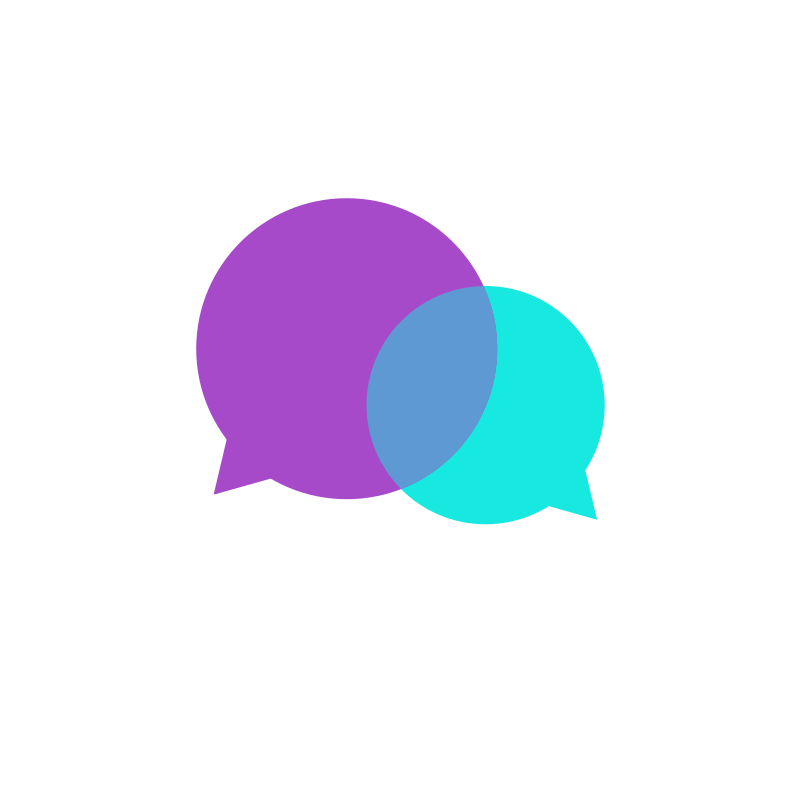

.size40[

* Venue: _Teatr Polonia_
* Termin: _7 grudnia_
* Limit miejsc: _260_
* Sprzedaż biletów: <mark>Trwa</mark>
* Call for papers: <mark>Trwa</mark>

]

---

class: slide-invert-colors

### ConFrontJS 2019 <mark>Sponsoring</mark>

.size45[

* Gold 🥇
* Silver 🥈
* Bronze 🥉

]

---

class: middle, slide-invert-colors

# ConFrontJS 2019 <mark>Zniżka</mark>

TODO

---

class: middle

# Blog

.size45[

🗣 Poszukujemy blogerów! 🗣

]

---

class: middle

# Newsletter

---

# Meetup 👋

.size45[

* Zdobywanie wiedzy
* Poznanie nowych osób
* Zdobywanie pracowników
* Poznawania nowych pracodawców
* Spróbowania sił jako prelegent

]

---

# Workshop

TODO

---

# MasterClass

TODO

---

class: middle

# Dziękuję

TODO — Sto lat

## ...i zapraszam na tort! 🎂
